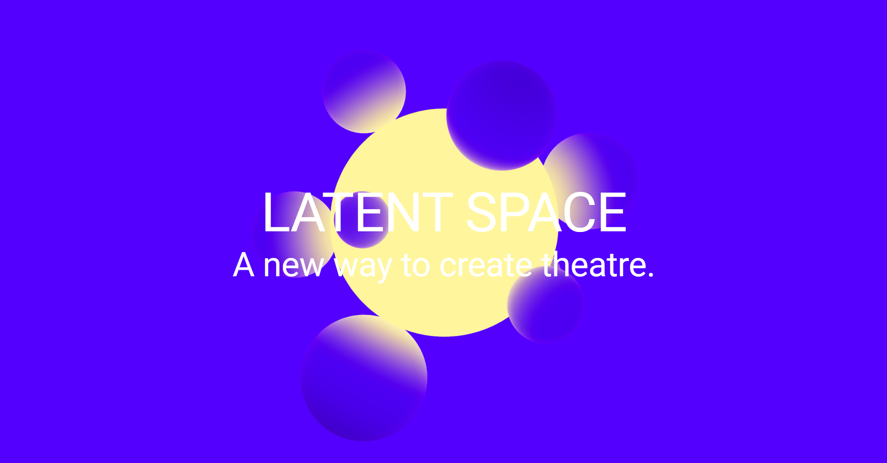

# LATENT SPACE
 
JS&Web2024 final project.

Author: ParaLLel


 
## About

This website is a demo of my Art Management + Technology project 'Latent Space', an attempt to unite technological innovation with performance arts. 

Made with Spline, React, and MUI. 

## How to use

```bash
npm install
npm run dev
```
    
Open http://localhost:5173/ to see the demo.